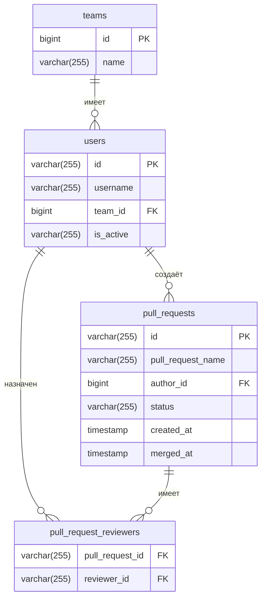

# avito-pr-reviewer-service
Микросервис, который автоматически назначает ревьюеров на Pull Request’ы (PR), а также позволяет управлять командами и участниками.

***

> ⚠️ **Внимание!** Этот сервис находится в разработке!!
### реализованные ручки: 
* /team/add

***

## Запуск

Для запуска сервиса достаточно выполнить команду:

```bash
docker-compose up
```
***
## 📊 Схема базы данных


## Допущения
* Отсутствие какой-либо валидации имён и ID (только не пустые)


* При создании User может быть задан любой статус поля isActive (true/false)
* User не может существовать без команды
* User может быть участником только ОДНОЙ команды (из структуры User)
* При изменении User нет проверки и изменения его принадлежности к открытым/мерджнутым ревью
  * -> при /pullRequest/reassign нет проверки, что автор уже существующего PullReq относится к одной и той же группе, что и изменяемый (old_reviewer_id), новый ищется по группе изменяемого


* Team может быть БЕЗ участников
  * -> отдельная структура Team
  * -> /team/get может выдать CODE 200 и пустой массив
* В команде может быть ЛЮБОЕ количество участников
* Если в /team/add будет дублирование userId вставится последнее вхождение юзера 


* Если при добавлении PR в таблице pull_request_reviewers уже оказалась пара reviewer_id-pull_request_id, то происходит добавление остальных (не ошибка)
* Запросы на получение из БД проверяет валидность данных и строно возвращает доменные структуры
* Если при /users/getReview user_id не существует ни в одном PR -> выдаст пустой массив (без проверки существования user_id в таблице Users) 
* Если при /users/getReview в таблице pull_requests не оказалось PR c pull_request_id которое есть pull_request_reviewers, то не будем выводить такой pullRequest

* Изменён порядок переменных в dto для 100% соответствия форматов ответов